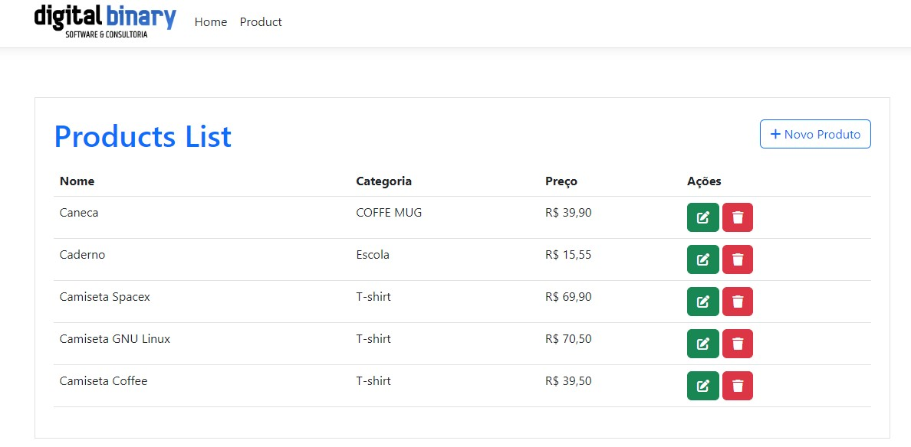

# Projeto De Microserviços

## Descrição
Projeto experimental com o intuito de aplicar as tecnologias aprendidas como Microserviços, Mensageria com RabbitMQ, Conteinerização com Docker e autenticação, 
utilizando Asp.Net e .Net 6.



## Prerequisites

✔ - .Net 6

✔ - Visual code ou Visual Studio 2022

✔ - MySql

✔ - Docker

✔ - RabbitMQ

## Quick Start

```
  
  git clone https://github.com/leandro-SI/microservices-dotNet6
  
  run project
  
```
