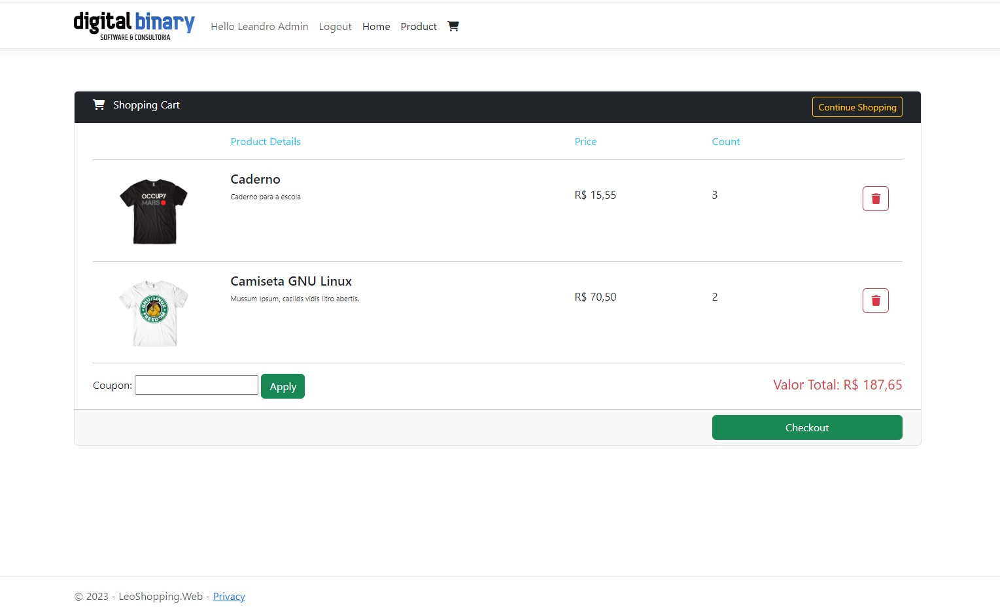

# Projeto De Microserviços

## Descrição
Projeto experimental com o intuito de aplicar as tecnologias aprendidas como Microserviços, Mensageria com RabbitMQ, Conteinerização com Docker e autenticação com Oauth2, OpenID e Identity Server, utilizando Asp.Net e .Net 6.

- Página Inicial


 ##
 
 - Tela novo Produto


 ##
 
 - Tela Home listagem de Produtos


 ##
 
 - Tela Detalhes Produto


 ##
 
 - Tela Carrinho de Compras


 ##
 
 - Tela de Checkout

 

## Prerequisites

✔ - .Net 6

✔ - Visual code ou Visual Studio 2022

✔ - MySql

✔ - Docker

✔ - RabbitMQ

## Quick Start

```
  
  git clone https://github.com/leandro-SI/microservices-dotNet6
  
  dotnet new --install Duende.IdentityServer.Templates
  
  run project
  
```
